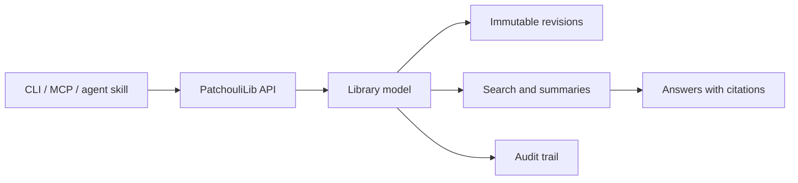

# PatchouliLib

PatchouliLib 是一个面向人类与软件 Agent 的可自托管知识库。它用于收拢可长期保存的
原始资料、保留版本历史，并通过适合 Agent 调用的接口提供检索与引用能力。

> [!IMPORTANT]
> PatchouliLib 已具备可运行的工程骨架、类型化 Agent 客户端、CLI、stdio MCP
> 适配器、限定范围的归档写入接口、非搜索读取接口，以及实验性的本地备份、校验和
> “恢复到全新目标”工具。全文检索与受支持的备份恢复策略仍未实现。各项能力究竟
> 属于“已实现”“实验中”还是“尚未实现”，以[当前路线图状态](ROADMAP.md)为准。

[简体中文兼容入口](README.zh-CN.md)

## 为什么做 PatchouliLib？

文件和对话归档很容易产生，却很难跨工具、跨设备复用。普通仓库能保存文件，但不
提供稳定身份、限定范围的检索、带版本语义的引用，也不解决多个 Agent 的受控访问
问题。

PatchouliLib 围绕一组尽量稳定的小型原语展开：

- `Library / Section / Book / Page / Revision` 内容模型；
- 不可变版本、软删除与显式恢复；
- 摘要、标签、全文检索与可选的信息点提炼；
- 稳定的 Page 标识符和 Wiki 风格的 `[[page-id]]` 引用；
- 有作用域的 Agent 凭据和可审计写入；
- 只给建议、未经批准不移动内容的自动整理机制。



## 设计原则

1. **数据属于部署者。** 项目必须可自托管、可导出。
2. **历史本身就是数据。** 普通修改创建新 Revision，不覆盖原始资料。
3. **分层检索。** 先从元数据和全文检索开始；只有在指标证明有效时才引入嵌入检索。
4. **Agent 是调用方，不是最终裁决者。** 自动整理默认只生成可审核的建议。
5. **基础设施可替换。** 公共设计和工作流不依赖维护者的私有主机、账号或部署拓扑。

## 文档

公共设计事实源位于 [docs/README.md](docs/README.md)。

| 领域 | 文档 |
| --- | --- |
| 产品范围 | [产品定位](docs/01-product-positioning.md) |
| 核心实体 | [知识库领域模型](docs/02-library-domain-model.md) |
| 数据安全 | [Page 版本与历史](docs/03-page-revision-and-history.md) |
| 检索上下文 | [提炼与摘要](docs/04-distillation-and-summary.md) |
| 查询接口 | [检索与托管 Agent](docs/05-retrieval-and-cloud-agent.md) |
| Agent 工作流 | [内置 Agent Skill](skills/patchouli-agent/SKILL.md) |
| 内容链接 | [标识符与引用](docs/06-identifiers-and-references.md) |
| 访问控制 | [身份验证、授权与审计](docs/07-authentication-and-audit.md) |
| 待决事项 | [开放问题](docs/08-open-questions.md) |
| 内容整理 | [自动整理](docs/09-automatic-organization.md) |

实施顺序记录在 [ROADMAP.md](ROADMAP.md) 中。

## 开发环境验证

安装 Python 3.13、uv、Node.js 24 和 npm 后运行：

```sh
python scripts/validate.py
```

Docker 启动后，可追加镜像构建和回环健康烟雾测试：

```sh
python scripts/validate.py --container
```

源码启动、Compose、CI、镜像发布，以及由管理员发起的私有更新契约，见
[开发、验证与交付](docs/development-and-delivery.md)。

项目还提供一个可选、受密码保护的[网页管理面板](docs/admin-web-console.md)，用于
初始化、凭据生命周期操作和 Agent/MCP 指引。面板默认关闭，不具备部署、Docker、
Shell 或备份恢复控制能力。

## 参与贡献

现阶段尤其欢迎带有明确使用场景或失败方式的设计反馈。提交 Issue 或 Pull Request
前，请先阅读 [CONTRIBUTING.md](CONTRIBUTING.md)。社区决策遵循
[GOVERNANCE.md](GOVERNANCE.md)，所有参与者都应遵守
[行为准则](CODE_OF_CONDUCT.md)。

不要在 Issue、Discussion、示例、测试数据或 Pull Request 中提交凭据、私有文档、
个人主机名和部署细节。安全问题请按 [SECURITY.md](SECURITY.md) 私下报告。

## 许可证

PatchouliLib 使用 [MIT License](LICENSE)。

PatchouliLib 是独立项目，与其他使用相似名称的项目或产品没有从属关系。
