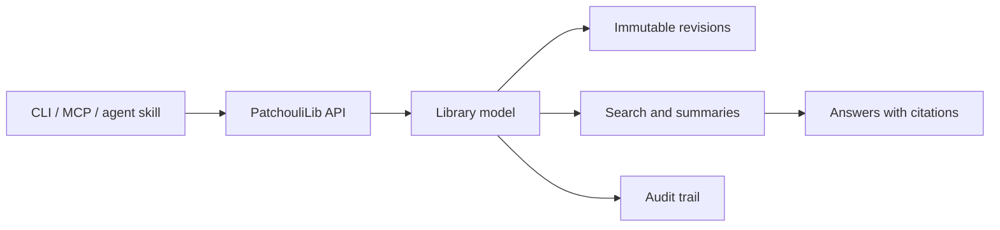

# PatchouliLib

PatchouliLib is a self-hostable knowledge library for people and software
agents. It is designed to collect durable source material, preserve revision
history, and expose retrieval and citation primitives through agent-friendly
interfaces.

> [!IMPORTANT]
> PatchouliLib is currently a design-stage project. There is no supported
> server, API, CLI, MCP server, or migration path yet.

[简体中文](README.zh-CN.md)

## Why PatchouliLib?

Files and chat archives are easy to create but difficult to reuse across tools
and machines. A plain repository provides storage, but it does not provide
stable identities, scoped retrieval, revision-aware citations, or controlled
access for multiple agents.

PatchouliLib explores a small set of durable primitives:

- a `Library / Section / Book / Page / Revision` content model;
- immutable revisions, soft deletion, and explicit recovery;
- summaries, tags, full-text search, and optional derived facts;
- stable page identifiers and wiki-style `[[page-id]]` references;
- scoped agent credentials and auditable writes;
- organization suggestions that never move content without approval.

## Design principles

1. **The operator owns the data.** The project must remain self-hostable and
   exportable.
2. **History is data.** Normal edits create revisions instead of overwriting
   source material.
3. **Retrieval is layered.** Start with metadata and full-text search; add
   embeddings only when they improve measured outcomes.
4. **Agents are callers, not authorities.** Automated organization produces
   reviewable suggestions by default.
5. **Infrastructure is replaceable.** Public design and workflows must not
   depend on a maintainer's private hosts, accounts, or deployment topology.

## Documentation

The public design source of truth is [docs/README.md](docs/README.md).

| Area | Document |
| --- | --- |
| Product scope | [Product positioning](docs/01-product-positioning.md) |
| Core entities | [Library domain model](docs/02-library-domain-model.md) |
| Data safety | [Page revisions and history](docs/03-page-revision-and-history.md) |
| Retrieval context | [Distillation and summaries](docs/04-distillation-and-summary.md) |
| Query interfaces | [Retrieval and hosted agents](docs/05-retrieval-and-cloud-agent.md) |
| Linking | [Identifiers and references](docs/06-identifiers-and-references.md) |
| Access control | [Authentication and audit](docs/07-authentication-and-audit.md) |
| Decisions needed | [Open questions](docs/08-open-questions.md) |
| Organization | [Automatic organization](docs/09-automatic-organization.md) |

The implementation sequence is tracked in [ROADMAP.md](ROADMAP.md).

## Contributing

Design feedback is useful now, especially when it includes a concrete use case
or failure mode. Read [CONTRIBUTING.md](CONTRIBUTING.md) before opening an issue
or pull request. Community decisions follow [GOVERNANCE.md](GOVERNANCE.md), and
all participation is covered by the [Code of Conduct](CODE_OF_CONDUCT.md).

Please do not include credentials, private documents, personal hostnames, or
deployment details in issues, discussions, examples, fixtures, or pull
requests. See [SECURITY.md](SECURITY.md) for private vulnerability reports.

## License

PatchouliLib is available under the [MIT License](LICENSE).

PatchouliLib is an independent project and is not affiliated with other
projects or products that use a similar name.
