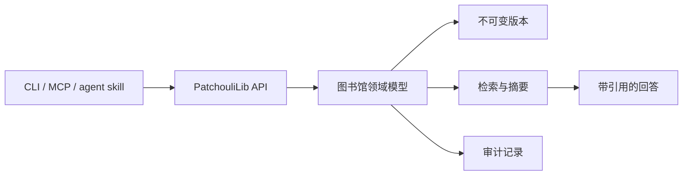

# PatchouliLib

PatchouliLib 是一个面向人类与软件 agent 的可自托管知识库。它用于收拢可长期保存的原始资料、保留版本历史，并通过适合 agent 调用的接口提供检索与引用能力。

> [!IMPORTANT]
> PatchouliLib 已具备可运行的工程骨架、类型化 Agent 客户端、CLI、stdio MCP adapter、限定范围的 archive 写入接口和非搜索读取接口。全文检索与受支持的备份恢复策略仍未实现。

[English](README.md)

## 为什么做 PatchouliLib？

文件和对话归档很容易产生，却很难跨工具、跨设备复用。普通仓库能保存文件，但不提供稳定身份、限定范围的检索、带版本语义的引用，也不解决多个 agent 的受控访问问题。

PatchouliLib 围绕一组尽量稳定的小型原语展开：

- `Library / Section / Book / Page / Revision` 内容模型；
- 不可变版本、软删除与显式恢复；
- summary、tag、全文检索与可选的信息点提炼；
- 稳定 Page ID 和 `[[page-id]]` 双向引用；
- 有作用域的 agent 凭据和可审计写入；
- 只给建议、未经批准不移动内容的自动整理机制。



## 设计原则

1. **数据属于部署者。** 项目必须可自托管、可导出。
2. **历史本身就是数据。** 普通修改创建新 Revision，不覆盖原始资料。
3. **分层检索。** 先从元数据和全文检索开始；只有在指标证明有效时才引入 embedding。
4. **Agent 是调用方，不是最终裁决者。** 自动整理默认只生成可审核的建议。
5. **基础设施可替换。** 公共设计和工作流不依赖维护者的私有主机、账号或部署拓扑。

## 文档

公共设计事实源位于 [docs/README.md](docs/README.md)，实施顺序见 [ROADMAP.md](ROADMAP.md)。当前文档先以英文维护，欢迎通过贡献流程补充高质量中文版本。

## 参与社区

设计阶段尤其欢迎带有明确使用场景或失败案例的反馈。提交 Issue 或 Pull Request 前，请先阅读 [CONTRIBUTING.md](CONTRIBUTING.md)。社区决策遵循 [GOVERNANCE.md](GOVERNANCE.md)，所有参与者都应遵守 [CODE_OF_CONDUCT.md](CODE_OF_CONDUCT.md)。

不要在 Issue、Discussion、示例、测试数据或 Pull Request 中提交凭据、私有文档、个人主机名和私有部署细节。安全问题请按 [SECURITY.md](SECURITY.md) 私下报告。

## 本地验证

安装 Python 3.13、uv、Node.js 24 和 npm 后运行：

```sh
python scripts/validate.py
```

Docker 启动后，可用 `python scripts/validate.py --container` 追加镜像构建和回环健康烟测。完整说明见 [开发、验证与交付](docs/development-and-delivery.md)。

GitHub Actions 只负责验证代码和发布带有准确摘要的容器镜像，不会登录私有服务器。更新私有实例时，管理员需要先登录服务器，再手动拉取并启动已验证的准确镜像；具体边界见同一份交付文档。

项目还提供一个默认关闭、必须通过 HTTPS 反向代理访问的[网页管理面板](docs/admin-web-console.zh-CN.md)。它使用密码登录，可完成首次初始化、operator 凭据恢复、Agent 授权与吊销，并内置 Agent/MCP 使用说明；第一版不能控制部署、Docker、主机命令或备份恢复。

## 许可证

PatchouliLib 使用 [MIT License](LICENSE)。

PatchouliLib 是独立项目，与其他使用相似名称的项目或产品没有从属关系。
